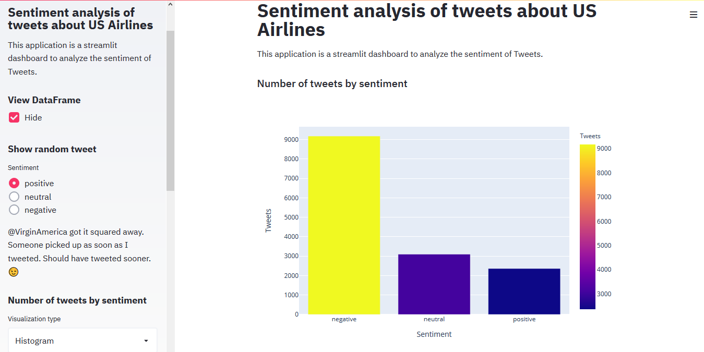
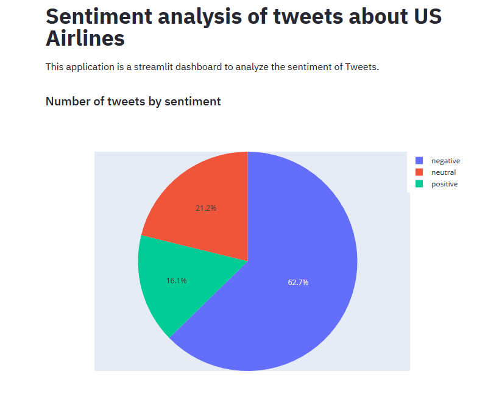
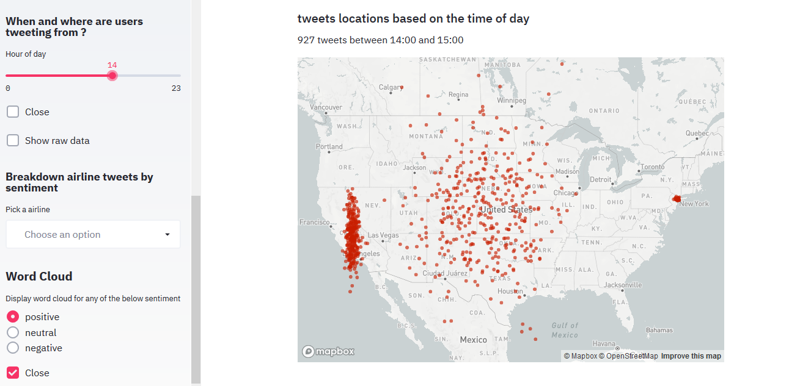
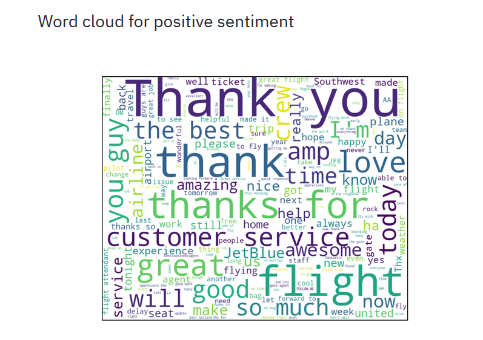

# Sentiment-analysis-of-tweets-about-US-Airlines

### Project Description:
The Project shows the analysis of how travelers expressed their feelings on Twitter about different US Airlines. The US Airlines analyzed are US Airways United , American , Southwest, Delta, Virgin America. I completed this project as a part of coursera online course. 

### Software and Libraries:

    1.pandas
    2.numpy
    3.sklearn
    4.streamlit
    5.Python 3
    
### Installation:
• Clone the repo to your computer.

• Open your terminal and navigate to the directory where the project is saved.

• Type pip install streamlit.

• After installed Type streamlit run app.py

### Images

I have attached below the screenshots and video of the streamlit dashboard.

 
• The above chart shows the selected sentiment (positive,negative, neutral) sentiment using historgram. We can clearly see that there are 9178 negative tweets , 3099 neutral tweets and 2363 positive tweets. The radio buttons on left side allows user to select random positive , neutral or negative tweets.
 

 
• The above pie chart clearly shows the percentage of different types of tweets.

 
• The above chart shows that user can select hour of the day to see number of tweets by locations on the map. The slider can be used to control the hour of day.

 

• The above chart shows word cloud for neutral sentiment.

• The above video shows the streamlit dashboard in action.

    
## References

    Wikipedia
    Datacamp
    Coursera
    A lot of googling to figure out how to do stuff.    

